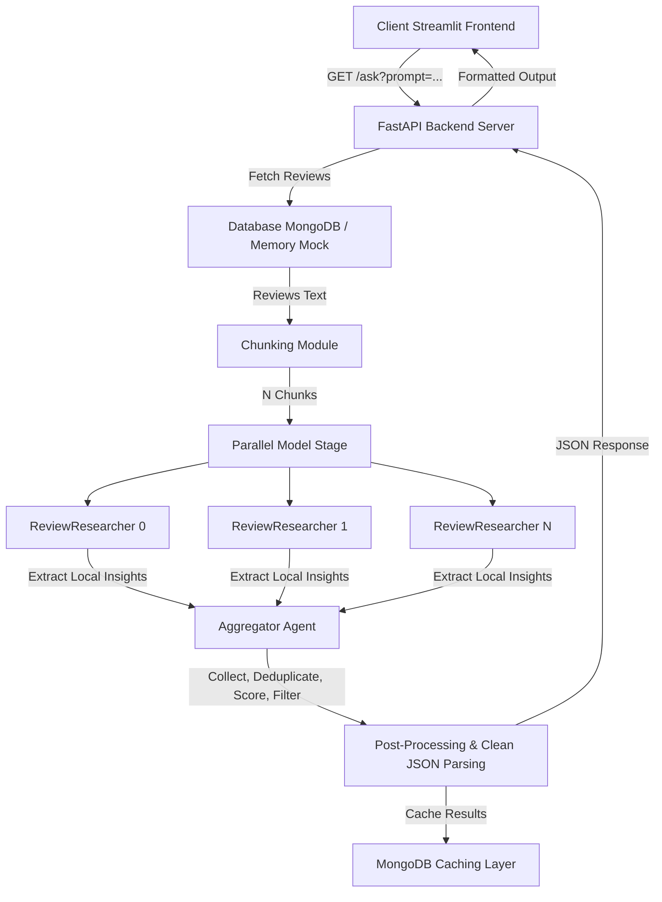

# litmus7 — Product Review Intelligence Platform

This document provides comprehensive technical documentation for the **litmus7** project. It details the problem statement, the system architecture, component details, the updated tech stack, and setup instructions.

---

## 1. Executive Summary

### The Problem
The massive volume of unstructured customer reviews makes manual analysis inefficient for businesses trying to extract actionable insights. Large Language Models (LLMs) struggle to analyze thousands of reviews simultaneously due to input context limits, potential hallucinations, and high API token costs.

### The Solution
litmus7 resolves this using a **divide-and-conquer AI agent pipeline**. Instead of sending all reviews to an LLM at once, the system chunks reviews (e.g., into blocks of 10–100 reviews), distributes them across parallel sub-agents to extract localized business-related insights, and runs a centralized Aggregator Agent to synthesize, deduplicate, score, and rank the findings.

---

## 2. Technical Architecture & Data Flow

Below is the execution flow from the client request to the final response:



---

## 3. Working Components

### 1. Request Handler (FastAPI)
The [FastAPI](file:///Users/muhsilnr/Library/Mobile%20Documents/com~apple%20CloudDocs/Documents/codespace/litmus7_project/main.py) endpoint receives review text via the `/ask` query parameter. It triggers the lifespan setup, verifies the model provider, and delegates analysis to the model provider layer.

### 2. Chunking Module
Splits the unstructured text block into smaller, manageable chunks of reviews (each review on a separate line) to prevent LLM context-window exhaustion and ensure granular analysis.
- $\le 10$ reviews: Chunk size = 3
- $10 - 100$ reviews: Chunk size = 10
- $> 100$ reviews: Chunk size = 100

### 3. Parallel Research Agents (Google ADK)
The system dynamically instantiates $N$ sub-agents (one per chunk of reviews) running in parallel using `google.adk.agents.ParallelAgent`. Each sub-agent extracts key business-relevant insights, representative quotes, confidence levels, and categories.

### 4. Synthesis & Aggregator Agent
The `AggregatorAgent` receives the output from all sub-agents and processes it through a 5-stage pipeline:
1. **Collect**: Gather all raw insights.
2. **Deduplicate**: Merge highly similar or duplicate insights, incrementing frequency counters and selecting representative quotes.
3. **Score/Rank**: Calculate a priority score using:
   $$\text{score} = \text{frequency} \times \text{confidence} \times \text{category\_weight}$$
   Where category weights are:
   - `quality`: 1.5
   - `support`: 1.2
   - `usability`: 1.3
   - `price`: 1.0
   - `other`: 1.0
4. **Quality Filter**: Drop low-frequency, low-confidence, or irrelevant items.
5. **Format**: Structure the output as a valid JSON array.

### 5. Caching Layer (MongoDB)
Ensures that if the same product reviews are requested twice, the pipeline does not re-run, saving hardware resources and eliminating latency.

---

## 4. The Technology Stack

- **Backend Framework**: FastAPI & Uvicorn
- **Orchestration Framework**: Google ADK (Agent Development Kit)
- **Model Connector**: LiteLLM (for local offline LLMs)
- **Local Model Provider**: LM Studio (defaulting to MLX-optimized local models like `qwen2.5-coder-7b-instruct-mlx` and lightweight extraction models like `llama-3.2-3b-instruct`)
- **Database / Cache**: MongoDB
- **Frontend**: Streamlit
- **Hosting**: Render

---

## 5. Development Setup & Quickstart

To run the project locally with the updated local LLM provider configuration:

1. **Recreate the Python Environment**:
   ```bash
   python3 -m venv .venv
   source .venv/bin/activate
   pip install fastapi uvicorn python-dotenv google-adk litellm pymongo streamlit matplotlib pandas
   ```

2. **Configure Environment Variables ([.env](file:///Users/muhsilnr/Library/Mobile%20Documents/com~apple%20CloudDocs/Documents/codespace/litmus7_project/.env))**:
   ```env
   LOCAL_MODEL_NAME=openai/qwen2.5-coder-7b-instruct-mlx
   LOCAL_PARALLEL_MODEL_NAME=openai/llama-3.2-3b-instruct
   OPENAI_API_BASE=http://localhost:1234/v1
   OPENAI_API_KEY=lm-studio
   ```

3. **Start the Local LLM**:
   - Open **LM Studio**.
   - Download/load a model (e.g., `qwen2.5-coder-7b-instruct-mlx`).
   - Start the local inference server (running on port `1234`).

4. **Launch the FastAPI Server**:
   ```bash
   uvicorn main:app --reload
   ```

5. **Query the Endpoint**:
   ```bash
   curl -G -s --data-urlencode "prompt=1. Great phone, battery life is excellent!
   2. The screen cracked on the first day, fragile." "http://127.0.0.1:8000/ask"
   ```

---

## 6. Team Members & Roles

- **Muhsil NR** — AI Integration & Architecture
- **Adwaith S Dileep** — Backend Delivery
- **Vigin PV** — Streamlit Frontend & Integration
- **Afeefa CS** — Database Management
- **Ranjana NR** — Data Chunking & Pre-processing
- **SifaMol M N** — Quality Analysis & Testing
