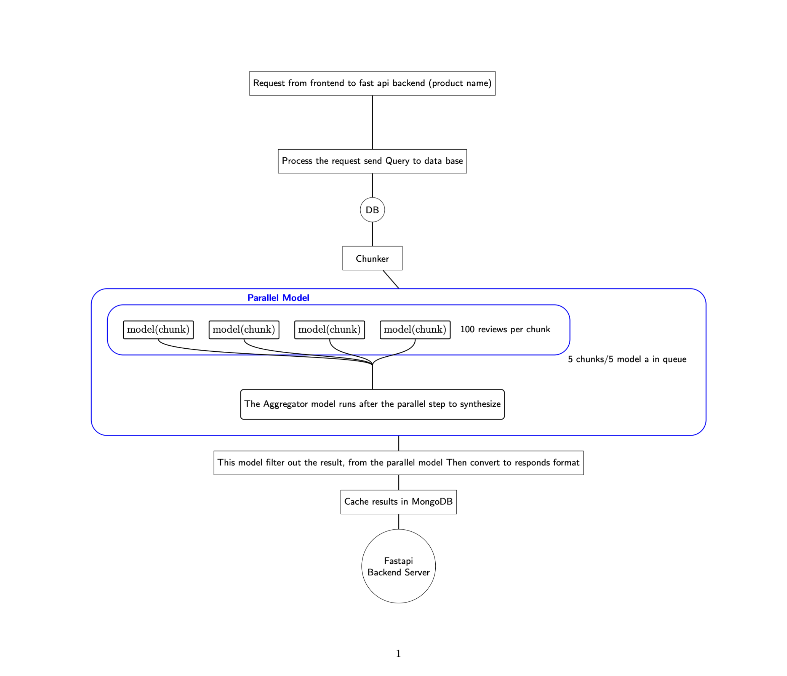

# litmus7_project

## The Problem
The immense volume of unstructured product reviews makes manual analysis inefficient for businesses seeking actionable insights.

## The Solution
- Instead of prompting an entire list of reviews, we use a Divide and conquer approach.
- Eg: 1000 reviews chunking the reviews into smaller chunks like 100 reviews. Then, take the Business-related context from the reviews.
- These chunks (100/1000 reviews) are sent to small sub parallel models of a root model.
- Then root model Aggregate the sub models and filter out the data for best result and quality.



---

## Technical Integration: Google ADK + LM Studio

We have integrated the **Google Agent Development Kit (ADK)** with a local **LM Studio** server running the `Qwen2.5-Coder-7B-Instruct-GGUF` model at `http://127.0.0.1:1234/v1`. 

This setup spawns parallel sub-agents (Sentiment Analyst, Intent Analyst, Metadata Auditor) to analyze a query concurrently. The outputs are cleaned, grouped, and passed to a Judge agent that resolves conflicts and outputs a structured Pydantic report including a reasoning chain.

### 1. Environment & Setup

1. Create a virtual environment:
   ```bash
   python -m venv .venv
   ```
2. Activate the virtual environment:
   - **Windows PowerShell:** `.venv\Scripts\Activate.ps1`
   - **Linux / MacOS / Git Bash:** `source .venv/bin/activate`
3. Install dependencies:
   ```bash
   pip install -r requirements.txt
   ```
   *(Ensure `google-adk`, `fastapi`, `uvicorn`, `httpx`, `pytest`, and `pytest-asyncio` are installed).*

### 2. Configuration

Set the environment variables if your LM Studio base URL or model name differs from the default:
- `LM_STUDIO_BASE_URL` (Default: `http://127.0.0.1:1234/v1`)
- `LM_STUDIO_MODEL_NAME` (Default: `Qwen2.5-Coder-7B-Instruct-GGUF`)

### 3. Running the Pipeline

#### Command Line Interface (CLI)
You can run the parallel-research and thinking-aggregation pipeline directly on any query:
```bash
python main.py --query "The service went offline and I'm very frustrated, please pause my subscription now!"
```

#### Web API (FastAPI)
1. Start the API server:
   ```bash
   uvicorn main:app --reload
   ```
2. Query the aggregator endpoint:
   ```text
   GET http://127.0.0.1:8000/aggregate?query=The service is down! I want to pause my subscription right now.
   ```

### 4. Running Tests

Run the test suite using pytest to verify log pre-filtering, grouping/deduplication, regex fallback parsing, and Judge agent orchestration:
```bash
pytest test_pipeline.py -v
```
